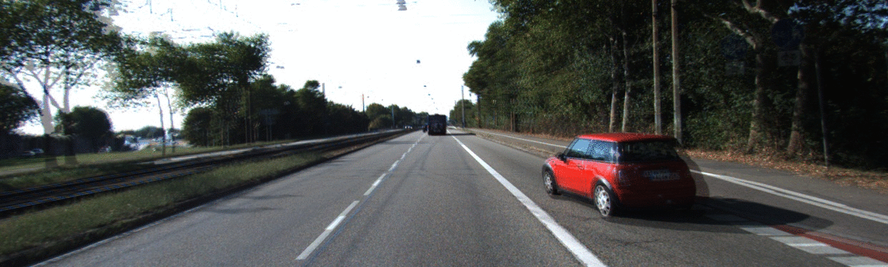
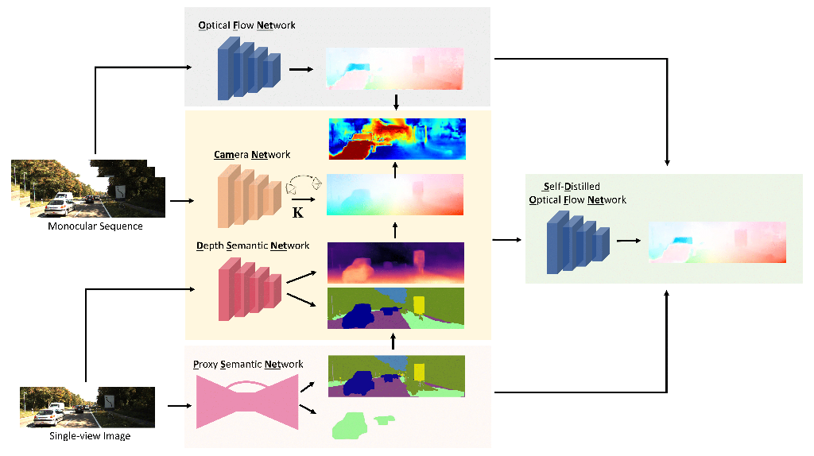

# Distilled semantics for comprehensive scene understanding from videos
Demo code of "Distilled semantics for comprehensive scene understanding from videos", published at [CVPR 2020](http://cvpr2020.thecvf.com/)

[[Paper]](https://arxiv.org/pdf/2003.14030.pdf) - [[Video]](assets/spotlight.mp4) - [[Poster]](assets/poster.pdf)

### Authors
[Fabio Tosi †](https://vision.disi.unibo.it/~ftosi/) - [Filippo Aleotti †](https://filippoaleotti.github.io/website/) - [Pierluigi Zama Ramirez †](https://pierlui92.github.io/) - [Matteo Poggi](https://mattpoggi.github.io/) - [Samuele Salti](https://vision.deis.unibo.it/ssalti/) - [Luigi Di Stefano](https://www.unibo.it/sitoweb/luigi.distefano/) - [Stefano Mattoccia](http://vision.deis.unibo.it/~smatt/)

† *joint first authorship*



**At the moment, we do not plan to release the training code.**
## Abstract
Whole understanding of the surroundings is  paramount to autonomous systems. Recent works have shown that deep neural networks can learn  geometry (depth) and motion (optical flow) from a  monocular video without any explicit supervision from ground truth annotations, particularly hard to source for these two tasks. In this paper, we take an additional step toward holistic scene understanding with monocular cameras by learning depth and motion alongside with semantics, with supervision for the latter provided by a pre-trained network distilling proxy ground truth images. 
We address the three tasks jointly by a) a novel training protocol based on knowledge distillation and self-supervision and b) a compact network architecture which enables efficient scene understanding on both power hungry GPUs and low-power embedded platforms.
We thoroughly assess the performance of our framework and show that it yields state-of-the-art results for monocular depth estimation, optical flow and motion segmentation. 

## Architecture



At training time, our final network is an ensamble of many sub networks (depicted in figure), where each one is in charge of a specific task:
* Camera Network: network in charge of intrinsics and pose estimation
* Depth Semantic Network (DSNet): network able to infer both depth and semantic for a given scene
* Optical Flow Network (OFNet): teacher optical flow network
* Self-Distilled Optical Flow Network: student optical flow network, used at testing time

At testing time, we rely on DSNet, CameraNet and Self-Distilled OFNet depending on the task.

## Requirements
For this project, you need TensorFlow version 1.8 and Python `2.x` or `3.x`.

You can install all the requirements easily running the command:
```bash
pip install -r requirements.txt
```

## Pretrained Models
Pretrained models are available for download:
| Training | Network | Resolution | zip |
|:-:|:--:|:--:|:--:|
| KITTI | Omeganet | 640x192 | [weights](https://drive.google.com/file/d/15MfMcAIJeg7TV8lqxa69qXF-COLGtTZe/view?usp=sharing) |
| CS + KITTI (EIGEN) | DSNet | 1024x320 | [weights](https://drive.google.com/file/d/1OUcq-ueT5i8-mkVRfpWOcxfH6ss8DY_F/view?usp=sharing) |
| CS | DSNet | 1024x320 | [weights](https://drive.google.com/file/d/1YdteQxo4MZukVlb8gIBZM4Tj_4bLC5F2/view?usp=sharing) |

## How To

### Run a Single Inference

You can run OmegaNet on a single image using the following command:

```
python single_inference.py --tgt $tgt_path [--ckpt $ckpt --tasks $tasks --dest $dest --src1 $src1 --src2 $src2]
```
where :
* `tgt`: path to target image (ie, image at time t0). Required
* `src1`: path to src1 image (ie, image at time t-1). Required only in case of `flow` or `mask` are in tasks list
* `src2`: path to src2 image (ie, image at time t+1). Required only in case of `flow` or `mask` are in tasks list
* `ckpt`: path to checkpoint. Required
* `tasks`: list of tasks to perform, space separated. Default [`inverse_depth`, `semantic`, `flow`]
* `dest`: destination folder. Default `results`

For instance, the following command run OmegaNet on an example batch from KITTI 2015 test set

```
python single_inference.py  --src1 assets/example/000018_09.png \
                            --tgt assets/example/000018_10.png \
                            --src2 assets/example/000018_11.png \
                            --ckpt models/omeganet
```

## Test
To test the network, you have to generate the artifacts for a specific task first, then you can test them.

### Generate Artifacts
You can generate the artifacts for a specific `task` running the following command:

```
python test.py --task $task --ckpt $ckpt \
                            [--cpu --load_only_baseline --filenames_file $filenames ] \
                            [--height $height --width $width --dest $dest]
```

where:

* `task`: task to perform. Can be [`depth`, `semantic`, `flow`]. Default `depth`
* `filenames`: path to filename.txt, where are listed all the images to load. Default `filenames/eigen_test.txt`
* `ckpt`: path to checkpoint. **Required**
* `load_only_baseline`: if set, load only Baseline (CameraNet+DSNet). Otherwise, full OmegaNet will be loaded. For instance, 
if you want to test a Baseline model SD-OFNet weights are not available, so you do not expect to load them.
* `height`: height of resized image. Default `192`
* `width`: width of resized image. Default `640`
* `dest`: where save artifacts. Default `artifacts`
* `cpu`: run test on cpu

#### Depth Artifacts
You can generate depth artifacts using the following script:
```
export datapath="/path/to/full_kitti/"
python test.py  --task depth \
                --datapath $datapath \
                --filenames_file filenames/eigen_test.txt \
                --ckpt models/omeganet \
                --load_only_baseline
```
where:
* `datapath`: path to your FULL KITTI dataset

#### Flow Artifacts
Artifacts for KITTI can be produced with the following command

```
export datapath="/path/to/3-frames-KITTI/"
python test.py  --task flow \
                --datapath $datapath \
                --filenames_file filenames/kitti_2015_test.txt \
                --ckpt models/omeganet
```

where:
* `datapath`: path to your 3-frames extended KITTI dataset

#### Semantic Artifacts
Artifacts for KITTI can be produced with the following command.

```
export datapath="/path_to_kitti/data_semantics/training/image_2"
python test.py --task semantic \
               --datapath $datapath \
               --filenames_file filenames/kitti_2015_test_semantic.txt \
               --ckpt path_to_ckpts/dsnet \
               --load_only_baseline
```
where:
* `datapath`: path to your images of the semantic kitti dataset

#### Motion Mask Artifacts
Artifacts for KITTI can be produced with the following command.

```
export datapath="/path/to/kitti/2015/"
python test.py --task mask \
               --ckpt path_to_ckpts/omeganet \
               --datapath $datapath \
               --filenames_file filenames/kitti_2015_test.txt
```
where:
* `datapath`: path to your 3-frames extended KITTI dataset

### Run tests

#### Depth
You can evaluate the maps running the command:

```
cd evaluators
python depth.py --datapath $datapath \
                --prediction_folder $prediction_folder
```

where:
* `datapath`: path to FULL KITTI dataset
* `prediction_folder`: path to folder with npy files, e.g. `../artifacts/depth/`

#### Flow
To test optical flow artifacts, run the command:

```
cd evaluators
python flow.py  --datapath $datapath \
                --prediction_folder $prediction_folder
```

where:
* `datapath`: path to KITTI/2015
* `prediction_folder`: path to flow predictions, e.g. `../artifacts/flow/`

#### Semantic
To test semantic run the following command:

```
cd evaluators
python semantic.py --datapath $datapath \
                   --prediction_folder $prediction_folder
```

where:
* `datapath`: path to KITTI/2015/data_semantics
* `prediction_folder`: path to semantic predictions, e.g. `../artifacts/semantic/`

#### Motion Mask
When motion mask artifacts are ready, you can test them on KITTI.

```
cd evaluators
python mask.py  --datapath $datapath \
                --prediction_folder $prediction_folder
```

where:
* `datapath`: path to KITTI/2015 folder
* `prediction_folder`: path to predicted moving masks, e.g. `../artifacts/mask`

## Citation
If you find this code useful in your research, please cite:

```
@inproceedings{tosi2020distilled,
  title={Distilled semantics for comprehensive scene understanding from videos},
  author={Tosi, Fabio and Aleotti, Filippo and Ramirez, Pierluigi Zama and Poggi, Matteo and Salti, Samuele and Di Stefano, Luigi and Mattoccia, Stefano},
  booktitle={Proceedings of the IEEE Conference on Computer Vision and Pattern Recognition},
  year={2020}
}
```

## License
Code is licensed under Apache 2.0 License. More information in the `LICENSE` file.

## Acknowledgements

Portions of our code are from other repositories:

* `Depth evaluation` is from [monodepth](https://github.com/mrharicot/monodepth), for "Unsupervised Monocular Depth Estimation with Left-Right Consistency, by C. Godard, O Mac Aodha, G. Brostow, CVPR 2017".
* `Flow Tools` are from https://github.com/liruoteng/OpticalFlowToolkit, licensed under MIT license.
* `Rigid flow estimation` is from [SfMLearner](https://github.com/tinghuiz/SfMLearner/blob/master), for "Unsupervised Learning of Depth and Ego-Motion from Video, by T. Zhou, M. Brown, N. Snavely, D. G. Lowe, CVPR 2017". Code is licensed under MIT License.
* `SelfFlow` network and utilities are from [SelfFlow](https://github.com/ppliuboy/SelFlow), for "SelFlow: Self-Supervised Learning of Optical Flow, by P. Liu, M. Lyu
, I. King, J. Xu, CVPR 2019". Code is licensed under MIT License.
* The `Teacher semantic network` is [DPC](https://github.com/tensorflow/models/tree/master/research/deeplab), for "Searching for Efficient Multi-Scale Architectures for Dense Image Prediction, by , L. C. Chen, M. D. Collins, Y. Zhu, G. Papandreou, B. Zoph, F. Schroff, H. Adam, J. Shlens, Advances in neural information processing systems 2018". Code is licensed under Apache v2 License. We used this network to generate proxy sematic maps.


We would like to thank all these authors for making their code publicly available and, eventually, for sharing pretrained models.
